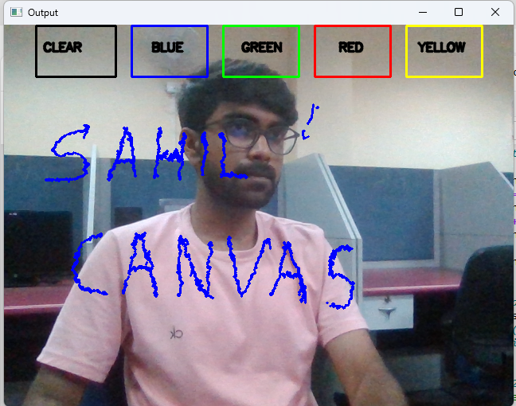

# Air Canvas Hand Tracking Project

Have you ever wanted to draw your ideas in mid-air with just the movement of your finger? This project introduces an Air Canvas that allows you to sketch anything by moving your hands and tracking the landmarks on your knuckles. It's a virtual drawing tool powered by the combination of OpenCV and MediaPipe, enabling you to draw using hand gestures.

🔧 Tools and Libraries Utilized:

- Python3, NumPy, OpenCV, MediaPipe

- **OpenCV**: This robust open-source library is crucial for real-time computer vision applications. It allows seamless video frame capture and processing from the webcam.

- **MediaPipe**: A remarkable framework by Google for building multimodal machine learning pipelines. In this project, MediaPipe is used for hand tracking, providing precise and real-time hand landmark recognition.

### How It Functions:

1. **Video Capture**: The script captures live video feed from the webcam using OpenCV.

2. **Frame Processing**: Each frame is processed with MediaPipe to identify and track hand landmarks.

3. **Landmark Drawing**: The detected hand landmarks are rendered on the video frames, creating a virtual canvas for air drawing.

### Algorithm:

1. **Frame Reading and Conversion**: Start by reading the frames and convert them to the HSV color space for easier color detection.

2. **Canvas Setup**: Prepare the canvas frame and add the ink selection buttons.

3. **MediaPipe Configuration**: Adjust MediaPipe settings to detect only one hand.

4. **Landmark Detection**: Pass the RGB frame to the MediaPipe hand detector to identify landmarks.

5. **Coordinate Storage**: Identify the forefinger coordinates and store them in arrays for consecutive frames.

6. **Drawing**: Use the stored coordinates to draw points on both the video frames and the canvas.

### Project Images:

